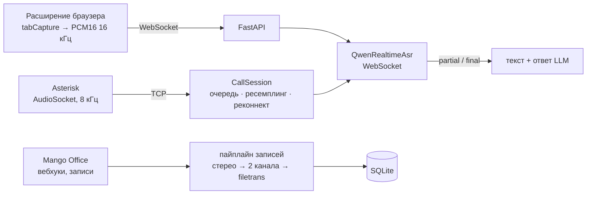

# CallsCenter ASR

Распознавание речи в звонках колл-центра на Qwen ASR. Три части: потоковый клиент
realtime-протокола, обработка записей облачной АТС Mango Office после звонка
и браузерное расширение, которое стримит звук вкладки на сервер и показывает
текст разговора и подсказку в реальном времени.

Исходный код закрыт. Здесь — устройство системы и решения, которые за ним стоят.
Код покажу на собеседовании, доступ на чтение дам по запросу.

Python · asyncio · FastAPI · WebSocket · Go · SQLite · Asterisk (AudioSocket) ·
Chrome Extension (Manifest V3) · Qwen ASR, Alibaba Model Studio

## Архитектура

Клиент ASR принимает сырой PCM16 mono и не знает, откуда пришёл звук: вкладка браузера,
телефонный канал, микрофон или файл. Новый источник добавляется рядом, клиент не меняется.



```python
async with QwenRealtimeAsr(cfg) as asr:
    asyncio.create_task(pump_audio(asr))   # asr.send_audio(pcm_chunk)
    async for ev in asr:
        if ev.type == FINAL:
            ...
```

## Решения

### Realtime только там, где есть медиапоток

План строился под собственную АТС, но оказалось, что используется Mango Office, а его
API не отдаёт потоковое аудио — только вебхуки о звонке и готовую запись. Поэтому работа
разбита на два трека:

- **после звонка** — транскрипт через 1–3 минуты по записи; закрывает контроль качества,
  теги, саммари и поиск по разговорам;
- **во время звонка** — только через свой узел в SIP-тракте (Asterisk AudioSocket);
  нужен, если оператору требуются подсказки в момент разговора.

Если заказчику нужна только аналитика, второй трек не делается вовсе — это недели экономии.

### Голоса разделяются транспортом, а не постобработкой

В realtime-распознавании нет диаризации. Оператор и клиент разделяются на уровне
канала: стерео-запись режется на два канала, каждый распознаётся отдельно.

### Протокол сверен с первоисточником

Подписи и лимиты Mango взяты из PDF официального API, а не из пересказов:

```
подпись запроса:      sha256(api_key + json + api_salt)
ссылка на запись:     sha256(api_key + timestamp + recording_id + api_salt)
лимиты:               10 запросов/с; stats/request — 1 запрос в 2 с
```

Сверка нашла расхождение с исходным планом — отдельная формула относится только
к GET-ссылке, а не к работе с записями вообще. Исправлено в коде, отмечено в отчёте.
Запросы идут через лимитер, записи скачиваются по событию «запись готова», а не
«запись началась» — на втором файла ещё может не быть.

### Идемпотентность

- Запись обрабатывается один раз: ключ — `recording_id`.
- Повторно доставленный вебхук не создаёт дубль.
- Задача, которую воркер взял и не закончил, подхватывается заново.
- Выгрузка за период режется на окна не больше 31 дня — ограничение API статистики.

### Задержка — измеряемая величина

CLI отдаёт файл в темпе реальной речи и в конце печатает медианную задержку финальной
фразы после конца речи. Без темпа записи замер задержки ничего не значит.

### Подводные камни, найденные по ходу

- Без `session.finish` перед закрытием сокета сервер отбрасывает последнюю фразу.
- Телефония отдаёт 8 кГц. Апсемплинг до 16 кГц потоковый: FIR-фильтр сохраняет
  состояние между кусками, иначе на стыках щелчки.
- `qwen3-asr` не поддерживает hotwords, а для колл-центра это важно: названия тарифов,
  продуктов, ФИО. Для этого нужны другие модели семейства.
- Ключ и регион Model Studio должны совпадать, иначе 401/403 прямо на handshake.

## Проверка

- 65 тестов pytest, 9 тестов Go, тесты жизненного цикла расширения.
- Пайплайн Mango проверен офлайн на моках HTTP: боевых ключей АТС не было.
- Расширение проверяется на тестовой странице с генератором тона: partial через 0,5 с
  звука, final через 2 с.

## Статус

MVP. Расширение работает в демо-режиме без ключей и с настоящими Qwen ASR
и LLM через OpenAI-совместимый API. Пайплайн записей Mango готов к подключению
боевых ключей.
